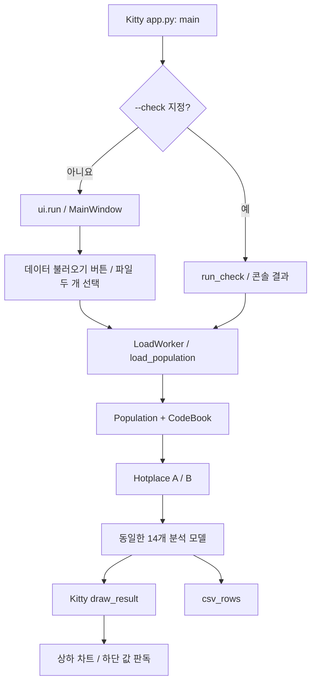

# Kitty ver — 코드 레벨 해설

대상: [seoul-population-kitty](seoul-population-kitty/) · [문서 목록](README.md) · [Original ver](original-ver.md)

## 1. 프로젝트의 구조와 변경 범위

Kitty 버전은 서울 생활인구의 **분석 모델을 유지하면서 화면 배치, 차트 조작, 테마와 아이콘을 변경한 별도 앱**이다. 같은 입력을 사용하는 두 버전의 수치는 같지만, 화면과 렌더러는 각각 구현되어 있다.

GUI 라이브러리도 다르다. Original은 PySide6(Qt 6), Kitty는 강의에서 쓰는 **PyQt5(Qt 5.15)** 로 작성했다. 신호는 `pyqtSignal`, 슬롯은 `pyqtSlot`으로 선언한다. 화면 전환 애니메이션은 두지 않고 기본 `QStackedWidget`으로 즉시 바꾼다.

화면은 **데이터 불러오기 → 차트 보기** 두 단계뿐이다. 상단 메뉴, 파일 경로를 입력하는 ‘데이터’ 화면, 숨겨 두었던 ‘지역 찾기’·‘비교 리포트’ 화면은 Kitty에서 삭제했다(Original에는 있다). 히트맵 두 개(요일×시간, 연령×시간)는 차트 선택 목록에서 비활성화했다.

`seoul-population-kitty/app.py`는 자신의 폴더를 `sys.path` 앞에 넣고 그 폴더의 `hotplace` 패키지를 가져온다. Original 폴더를 런타임에 참조하지 않는다.

### 파일별 관계

| 파일 | Original과의 관계 | Kitty에서의 책임 |
|---|---|---|
| [dataset.py](seoul-population-kitty/hotplace/dataset.py) | 기본 데이터 폴더 탐색(`default_data_dir`)이 다르고, 파일 종류 판별(`identify_csv`)을 추가 | CSV 검증, 행정동 집계, 캐시 |
| [hotplace.py](seoul-population-kitty/hotplace/hotplace.py) | 현재 내용 동일 | 14개 분석과 결과 데이터 클래스 |
| [analytics.py](seoul-population-kitty/hotplace/analytics.py) | 현재 내용 동일 | 진단·비교·텍스트 리포트 |
| [__init__.py](seoul-population-kitty/hotplace/__init__.py) | 설명 문구의 GUI 라이브러리 이름만 다름 | 패키지에서 사용할 이름 내보내기 |
| [app.py](seoul-population-kitty/app.py) | CLI 그림 크기·저장 DPI 변경 | GUI/CLI 진입 |
| [ui.py](seoul-population-kitty/hotplace/ui.py) | 수정 | 파일 두 개 선택 → 로딩 → 좌측 지역 패널과 차트. 메뉴·데이터·검색·리포트 화면 삭제 |
| [widgets.py](seoul-population-kitty/hotplace/widgets.py) | 수정 | 차트 선택 콤보, 세로 지표, 탐색 도구 모음. 메뉴 버튼·리포트 카드 삭제 |
| [plotting.py](seoul-population-kitty/hotplace/plotting.py) | 수정 | 상하 비교 차트, 신호 기반 값 판독 |
| [theme.py](seoul-population-kitty/hotplace/theme.py) | 수정 | Kitty 팔레트·Qt 스타일·SVG 로딩 |
| [assets](seoul-population-kitty/hotplace/assets/) | 추가 | Kitty SVG와 출처 기록 |
| [Hotplace.spec](seoul-population-kitty/Hotplace.spec) | 수정 | 별도 앱 이름·번들 ID, SVG 포함 |
| [pyproject.toml](seoul-population-kitty/pyproject.toml) | 추가 | PyQt5 전용 의존성. 루트 환경(PySide6)과 분리 |

내용이 동일한 파일도 실제로는 복사본이다. 한쪽의 계산식을 바꾸면 다른 쪽도 별도로 반영해야 한다. 두 앱은 모두 `hotplace`라는 패키지 이름을 사용하므로, 테스트는 프로젝트별 별도 Python 프로세스로 실행하는 것이 명확하다.

## 2. 실행에서 분석 결과까지



### 2.1 `main()`과 `run()`

[app.py](seoul-population-kitty/app.py)의 명령줄 인자는 Original과 같다. `--check`가 있으면 `run_check()`, 없으면 `ui.run()`을 실행한다. 인자 없는 `--check`도 지원하며, `--out`은 이 경로에서만 사용한다.

GUI의 `run()`은 `QApplication`을 만들고 `MainWindow`를 표시한다. `_build_ui()`가 `apply_theme(QApplication.instance(), False)`를 호출해 밝은 테마로 시작한다. 시스템 팔레트 밝기를 확인하는 Original의 초기 테마 선택 코드는 없다.

`--population`과 `--codes`를 모두 주면 창을 표시한 직후 `start_load()`로 바로 불러온다. 주지 않으면 사용자가 ‘데이터 불러오기’ 버튼으로 파일을 고른다.

### 2.2 공통 데이터 처리 구조

Kitty도 다음 자료구조를 사용한다.

```text
CodeBook
  코드 → Dong(code, sido, sigungu, name)

Population.aggregates[코드] → DongAggregate
  total[24], counts[24]
  weekday[24], weekday_counts[24]
  weekend[24], weekend_counts[24]
  age[24][28]
  daily[날짜][시간] → 총생활인구
```

`load_population()`은 UTF-8 CSV를 한 행씩 읽고 검증한다. 인구 파일은 날짜·시간·코드·총인구·남자 14열·여자 14열의 고정 위치를 사용한다. 코드표는 헤더 두 줄을 건너뛰고 정수 코드로 연결한다.

중복 `(코드, 날짜, 시간)`은 첫 관측만 집계한다. 누락 시간은 관측 횟수를 늘리지 않으므로 `Hotplace._mean()`에서 실제 관측 횟수로 나눌 수 있다. 관측이 없는 값은 `NaN`으로 표현한다.

예를 들어 두 날짜의 14시 인구가 200명, 400명이면 `total[14] = 600`, `counts[14] = 2`, 평균은 300명이다. 달력 기간에 관측이 빠진 날짜가 더 있어도 이를 0명으로 넣지 않는다.

기본 데이터 경로는 `HOTPLACE_DATA_DIR`, 저장소 `data/`, 형제 강의 저장소 데이터 폴더 순이다. 캐시는 경로·크기·수정시각 기반의 `agg-v4-*.pickle`이며, 소스 실행 시 Kitty 폴더의 `.cache/`를 사용한다. macOS 번들에서는 Original과 같은 `~/Library/Caches/Hotplace/` 경로를 사용한다.

구체적인 CSV 열, 품질 분모, 캐시 동작은 [Original 코드 해설](original-ver.md)의 데이터 처리 설명과 동일하다.

## 3. 유지되는 분석 API

소스: [hotplace.py](seoul-population-kitty/hotplace/hotplace.py)

`Hotplace(dong, population)`은 해당 지역 집계를 참조한다. 분석 메서드는 색·레이아웃·Qt 위젯을 다루지 않는다. 결과에 들어 있는 숫자를 Kitty의 렌더러가 받아 그린다.

| 분석 | 메서드 반환 타입 | 핵심 계산 |
|---|---|---|
| `analysis1` 시간대 | `LineSeries` | 시간별 누적 ÷ 실제 관측 횟수 |
| `analysis2` 평일·주말 | `LineSeries` | 평일/주말 각각의 시간별 평균 |
| `analysis3` 성별 | `LineSeries` | 시간별 남자 14구간·여자 14구간 합의 관측 평균 |
| `analysis4(other)` 겹쳐 보기 | `LineSeries` | A/B 시간대 평균을 두 계열로 반환 |
| `analysis5` 연령 | `AgePyramid` | 성별·연령 누적 ÷ 전체 관측 수 |
| `analysis6` 일별 추이 | `LineSeries` | 완전한 24시간 일평균과 연속 7일 이동평균 |
| `analysis7` 요일×시간 | `Heatmap` | 요일·시간별 관측 평균 `7 × 24` |
| `analysis8(other)` 흐름 비교 | `LineSeries` | 지역의 시간대 평균을 100으로 정규화 |
| `analysis9(other)` 시간대별 차이 | `HourlyGap` | 시간별 A − B |
| `analysis10` 요일별 | `LineSeries` | 요일×시간 평균을 요일마다 다시 평균 |
| `analysis11` 여성 비율 | `LineSeries` | 여자 ÷ 남녀 합 × 100 |
| `analysis12(other)` 연령 비중 | `AgeShares` | 지역별 남녀 합산 연령 비중 |
| `analysis13` 연령×시간 | `Heatmap` | 시간별 성별·연령 합을 분모로 연령 비중 계산 `14 × 24` |
| `analysis14(other, codebook)` 서울 속 위치 | `CityScatter` | 매칭된 지역의 낮/밤·주말/평일 배율과 A/B 표시 |

GUI에서는 단일 지역용 메서드를 A와 B에 각각 적용한 뒤 `PairedAnalysis`로 묶는다. `PAIR_TABS = {3, 7, 8, 11}`은 두 지역을 직접 받는 분석 4·8·9·12다. `CITY_TAB = 13`은 코드표까지 필요한 분석 14다.

`summary()`의 주요 지표는 시간대 평균의 평균, 가장 붐비는 시간, 낮(09~18시)/밤(00~06시), 주말/평일 배율이다. 상권 유형도 Original과 동일한 상수와 조건 순서로 결정한다. 팔레트 변경이 분류 결과에 영향을 주지는 않는다.

[analytics.py](seoul-population-kitty/hotplace/analytics.py)의 `diagnostics()`·`compare_places()`·`report_text()`도 그대로 있다. GUI는 이 모듈을 더 이상 쓰지 않지만 `--check`의 비교 리포트 출력과 Python API 계산은 가능하다.

## 4. `ui.py`: 데이터 불러오기 → 차트 보기

### 4.1 전체 위젯 트리

```text
MainWindow — QVBoxLayout
  appHeader
    Kitty 아이콘 + 앱 제목
  pageHeader
    제목·설명 / 데이터 기간·상태 / ‘다른 데이터 불러오기’(불러온 뒤에만 표시)
  pages — QStackedWidget
    0: 데이터 불러오기 — 안내 카드
         ‘데이터 불러오기’ 버튼, 진행 막대, 세 단계 안내
    1: 차트 보기 — QHBoxLayout
         왼쪽 sidebar (292px)
           지역 A 선택
           지역 B 선택
           지역 교환
           주요 지표 카드 4개
         오른쪽 QVBoxLayout
           동일 지역 안내
           차트 패널
           상권 유형·상세 통계
  상태 표시줄
```

Original은 최상위가 `QHBoxLayout`(왼쪽 메뉴)이고 화면이 네 개다. Kitty는 최상위를 `QVBoxLayout`으로 두고 화면을 두 장만 가진다. `_build_dashboard()`는 `QHBoxLayout`으로 지역 선택과 차트를 좌우로 나눈다.

초기 창 크기는 `1480 × 980`, 최소 크기는 `1080 × 740`이다. Fluent `ScrollArea`를 사용해 내용이 길어지면 세로로 스크롤한다. `setSmoothMode(SmoothMode.NO_SMOOTH, Qt.Vertical)`로 휠 스크롤 애니메이션을 끈다.

### 4.2 파일 두 개를 고르는 ‘데이터 불러오기’

첫 화면의 버튼과 상단의 ‘다른 데이터 불러오기’는 모두 `load_data()`에 연결된다.

```text
load_data()
  → _pick_files()
      QFileDialog.getOpenFileNames()        두 CSV를 한 번에 선택
      identify_csv(path)                    첫 줄의 열 개수로 종류 판별
      하나만 골랐으면 getOpenFileName()으로 나머지를 이어서 묻는다
  → start_load(population_csv, code_csv)
```

[dataset.py](seoul-population-kitty/hotplace/dataset.py)의 `identify_csv()`는 CSV 첫 줄을 읽어 열이 32개(`COL_END`) 이상이면 `"population"`, 아니면 `"codes"`를 돌려준다. 생활인구 파일은 32열 이상, 코드표는 5열이므로 파일 이름이나 고른 순서와 무관하게 구분된다.

`_pick_files()`는 다음 경우 불러오기를 시작하지 않는다.

| 상황 | 처리 |
|---|---|
| 선택 취소 | 아무 일도 하지 않는다 |
| 세 개 이상 선택 | “두 파일만 선택하세요” 경고 |
| 두 파일이 같은 종류 | 어떤 형식이 겹쳤는지 경고 |
| 이어서 고른 파일의 종류가 다름 | 경고 |
| 읽을 수 없는 파일(UTF-8 아님 등) | `DataError`를 오류 창으로 표시 |

파일 선택 창은 `default_data_dir()`이 찾은 기본 데이터 폴더에서 열리고, 이후에는 마지막으로 고른 폴더(`_last_dir`)에서 열린다.

`start_load(population_csv, code_csv)` → `LoadWorker` → `load_population()` → `_on_loaded()`/`_on_failed()` 흐름은 유지한다. 불러오는 동안에는 `pages`를 0번으로 돌려 첫 화면의 진행 막대를 보여 주고 두 버튼을 잠근다. 성공하면 1번(차트 보기)으로 넘어간다. 실패한 재로딩은 이전 분석을 보존하고 그 차트로 돌아간다. 로딩 중 종료는 스레드 중단 요청과 정리 이후 처리한다.

행정동 수·기간은 `pageHeader`에 표시한다. 이전 ‘데이터’ 화면에 있던 관측 완전성·중복 행 표는 GUI에서 없어졌고, `app.py --check`가 같은 값을 출력한다.

### 4.3 지역 선택기와 지표 카드

`RegionSelector`는 배지·제목을 위쪽에 두고 자치구·행정동 콤보를 아래 행에 둔다. `region="A"` 또는 `region="B"` 속성도 지정한다.

동작은 기존과 같다. `userData`에 `Dong`을 저장하고, `changed` 신호가 `_on_region_changed()`를 호출한다. `_loading`은 목록을 채우는 중 불필요한 변경 처리를 막는 내부 상태다.

[widgets.py](seoul-population-kitty/hotplace/widgets.py)의 `ComparisonMetrics`는 `QVBoxLayout`에 `metricCard` 네 개를 추가한다. 각 카드 안에는 A/B 값을 가로로 놓는다. `MetricLabels`가 같은 키(`daily_avg`, `peak_hour`, `day_night_ratio`, `weekend_ratio`)로 값을 갱신하므로 레이아웃 변경이 계산 코드를 바꾸지 않는다.

## 5. `widgets.py`: 차트 선택과 조작

### 5.1 `AnalysisTabs`는 두 콤보를 연결한다

이름은 `AnalysisTabs`를 유지하지만, 실제 선택 UI는 `group_picker`와 `chart_picker` 두 `ComboBox`다.

| 상태 | 의미 |
|---|---|
| `_titles` | 14개 차트의 표시 이름 |
| `_groups` | 분류별 차트 인덱스 목록 |
| `_group_of[index]` | 차트가 속한 분류 |
| `_last[group]` | 분류별 마지막 선택 차트 |
| `stack` | 14개 `AnalysisTab`을 가진 `QStackedWidget` |

```text
분석 분류 변경
  → _choose_group(group)
  → setCurrentIndex(_last[group])
  → stack.currentChanged
  → _changed(index)
      → _select(index): 두 콤보 선택 동기화
      → currentChanged.emit(index)
  → MainWindow._render_current()
```

`_select()`는 콤보의 신호를 차단한 상태에서 목록과 선택을 갱신한다. 그렇지 않으면 목록 갱신이 다시 선택 이벤트를 발생시켜 중복 처리될 수 있다.

**히트맵 비활성화.** `ui.py`는 전체 묶음(`ALL_GROUPS`)에서 `DISABLED_CHARTS`에 든 번호를 뺀 `TAB_GROUPS`를 `AnalysisTabs`에 넘긴다.

```python
DISABLED_CHARTS = frozenset({6, 12})      # 요일×시간, 연령×시간
TAB_GROUPS = tuple(
    (name, tuple(chart for chart in charts if chart not in DISABLED_CHARTS))
    for name, charts in ALL_GROUPS
)
```

`stack`에는 여전히 14장이 있어 “차트 번호 i ↔ `analysis(i+1)`” 대응이 유지된다. 목록에 없는 번호는 `_group_of`에도 없으므로 `setCurrentIndex()`가 무시한다. 집합에서 번호를 지우면 해당 차트가 다시 나타난다. 같은 방식으로 다른 차트도 뺄 수 있다.

`chart_picker`의 행 번호와 분석 인덱스는 다르다. 예를 들어 ‘하루 흐름’ 분류의 인덱스 순서는 `(0, 1, 3, 8, 7)`이다. `_choose_chart()`는 `currentData()`에 저장된 전역 차트 인덱스를 읽으므로 분석 번호가 정확히 연결된다.

### 5.2 `AnalysisTab`과 `AnalysisToolbar`

각 `AnalysisTab`은 다음 요소를 묶는다.

- `canvas`: `PlotCanvas`
- `toolbar`: `NavigationToolbar2QT`를 상속한 `AnalysisToolbar`
- `readout`: 실제 인구 값을 표시하는 하단 `QLabel`
- `hint`: 마우스가 차트를 벗어났을 때 돌아갈 기본 안내

`AnalysisToolbar.toolitems`는 처음 범위·뒤로·앞으로·이동·확대만 노출한다. 이동 모드에서는 드래그로 이동하고 확대 모드에서는 영역을 드래그해 확대한다. 저장은 `MainWindow`의 별도 PNG/CSV 버튼이 담당한다.

도구 모음의 기본 좌표 라벨은 숨긴다. `canvas.hovered.connect(self._show_readout)`로 연결한 인구 값 안내를 대신 사용한다. `_render_current()`는 그리기 전 도구 모음을 숨기고, 성공 후 다시 보여주며 `toolbar.update()`를 호출한다.

### 5.3 즉시 전환

두 화면(`pages`)과 차트(`AnalysisTabs.stack`)는 기본 `QStackedWidget.setCurrentIndex()`로 즉시 바뀐다. Original의 `AnimatedStack`·`TransitionOverlay`(페이드·슬라이드)와 `HOTPLACE_REDUCED_MOTION` 설정은 Kitty에 없다. Fluent 위젯이 자체적으로 가진 움직임도 같은 모양을 유지한 채 끈다.

| 위치 | 끄는 방법 |
|---|---|
| 휠 스크롤 | `ScrollArea.setSmoothMode(SmoothMode.NO_SMOOTH, Qt.Vertical)` |
| 진행 막대 | `ProgressBar(useAni=False)` |
| 콤보 목록 | `widgets.ComboBox`가 목록(`_ComboMenu`)을 띄운 직후 펼침 애니메이션을 끝 위치로 넘긴다 |
| 완료 알림 | `MainWindow._notify()`가 `InfoBarPosition.NONE`으로 만들어 직접 오른쪽 위에 놓고, `QTimer`로 2.5초 뒤 닫는다 |

## 6. `plotting.py`: 같은 결과를 다르게 그리기

### 6.1 A/B 패널의 방향 변경

일반 비교 차트와 피라미드는 다음 줄로 두 축을 만든다.

```python
axes = canvas.figure.subplots(2, 1, sharex=True, sharey=True)
```

Original의 `subplots(1, 2, ...)`와 달리 A가 위, B가 아래에 온다. 각 패널에 `A · 지역명`, `B · 지역명` 제목을 붙이고, 공유 축에서도 두 패널 모두 눈금이 보이도록 `labelleft=True, labelbottom=True`를 지정한다.

`_value_limits(comparison.analyses)`는 두 지역 값을 함께 보고 y축 범위를 정한다. 피라미드는 두 지역의 남녀 최댓값으로 대칭 x축 범위를 정한다. `sharex`·`sharey` 덕분에 도구 모음으로 범위를 바꿀 때 두 패널이 함께 움직인다.

히트맵은 Original도 `2 × 1` 배치였다. Kitty에서도 이를 유지하고 두 지역에 같은 `vmin=0`, `vmax=peak`와 색 막대를 적용한다. 다만 Kitty GUI에서는 히트맵 두 개를 선택 목록에서 뺐으므로(5.1 참고) 이 렌더러는 `app.py --check --out`의 PNG 저장에서만 쓰인다.

겹쳐 보기·정규화 흐름·시간대별 차이·연령 비중·서울 속 위치는 하나의 결과를 한 축에 그리는 비교 분석이다. 모든 차트가 두 패널인 것은 아니다.

### 6.2 결과 타입에 따른 렌더러

`draw_result()`는 `PairedAnalysis`, `HourlyGap`, `AgeShares`, `CityScatter`, `AgePyramid` 순으로 타입을 검사하고 나머지는 `draw_line_series()`로 보낸다. `PairedAnalysis` 안의 `Heatmap`은 `draw_heatmaps()`로 분기한다.

`draw_line_series()`는 선 모양·투명도로 한 지역 안의 두 계열을 구분하고 정점에 직접 라벨을 붙인다. 단일 계열이며 기준선이 없을 때는 `fill_between(..., alpha=0.07)`로 영역을 채운다.

피라미드와 차이 막대는 일반 `barh()`·`bar()`를 사용한다. Original의 `RoundedBar`, 그라데이션 `_area()`, 커서 옆 `HoverCallout`, 직접 확대·이동 메서드는 Kitty 구현에 없다.

### 6.3 마우스 판독은 문자열 신호로 전달한다

```python
class PlotCanvas(FigureCanvasQTAgg):
    hovered = pyqtSignal(str)
```

```text
motion_notify_event
  → PlotCanvas._on_hover(event)
  → 등록된 _hover_lookup(event)
  → (위치 키, 판독 문자열)
  → hovered.emit(text)
  → AnalysisTab._show_readout(text)
  → 하단 QLabel 갱신
```

같은 위치 키면 다시 갱신하지 않는다. 마우스가 밖으로 나가면 `clear_hover()`가 가이드를 숨기고 빈 문자열을 보내 기본 안내로 돌아간다. 도구 모음이 `widgetlock`을 사용 중이면 판독을 중단한다.

| 차트 | 조회 방법 |
|---|---|
| 시간·날짜·요일·차이 | x좌표를 반올림해 인덱스를 정하고 A/B 값을 함께 읽음. 같은 위치의 세로 가이드 표시 |
| 히트맵 | x/y좌표를 시간/행 인덱스로 바꿔 두 지역의 칸 값 조회 |
| 연령 비중 | y좌표를 연령 구간으로 바꿔 A/B 비중·%p 차이 조회 |
| 서울 속 위치 | 데이터 좌표를 화면 좌표로 변환하고 커서에서 12px 이내 가장 가까운 점 조회 |

Kitty 히트맵·연령 비중·산점도의 조회 함수는 판독 문자열을 반환한다. Original의 셀 테두리·선택 점 강조까지 동일하게 구현된 것은 아니다.

### 6.4 크기·DPI와 PNG 저장 차이

| 경로 | Original | Kitty |
|---|---|---|
| GUI Figure 생성 | 72 DPI | 110 DPI |
| GUI PNG 저장 | `EXPORT_DPI = 144` | 200 DPI |
| CLI Figure 생성 | `(820/72, 500/72)`인치, 72 DPI | `(7.4, 7.2)`인치, 110 DPI |
| CLI PNG 저장 | 144 DPI | 160 DPI |

Kitty의 GUI PNG 저장과 CLI PNG 저장은 서로 다른 DPI를 쓴다. 두 버전 모두 화면에서 판독용 가이드를 지운 뒤 PNG를 저장한다.

`CHART_HEIGHTS`와 기본 차트 높이도 상하 배치에 맞춰 늘어났다. Kitty의 기본 최소 차트 패널 높이는 650이고, 연령×시간 분석은 880이다. 이는 Figure 자체의 DPI와 별개인 UI 레이아웃 값이다.

## 7. `theme.py`: 팔레트와 Kitty SVG

### 7.1 색상 데이터와 적용 위치

소스: [theme.py](seoul-population-kitty/hotplace/theme.py)

| 상수 | 값 | 밝은 테마에서의 용도 |
|---|---|---|
| `KITTY_RED` | `#f90013` | 강조색, 지역 A |
| `KITTY_BLUE` | `#0054ae` | 지역 B, 히트맵 진한 끝 색 |
| `KITTY_WHITE` | `#ffffff` | 카드 배경, 강조 버튼 글자 |
| `KITTY_BROWN` | `#251815` | 기본 글자 |
| `KITTY_YELLOW` | `#ffe700` | 팔레트 상수·SVG 색, 코드에 남은 어두운 테마 강조색 |

`LIGHT`는 이 상수와 옅은 변형을 `Theme`에 담는다. `series=(KITTY_RED, KITTY_BLUE)`, `series_soft`, `heat`를 차트와 Qt 스타일이 함께 사용한다. Original에 있는 `series_ink` 필드는 Kitty의 `Theme`에는 없다.

`apply_theme()`는 Fluent 테마, `QPalette`, 앱 글꼴, QSS를 갱신한다. `metricCard`, `chartControls`, `appHeader`, `fileBoard` 등의 `role`·`objectName`이 어떤 스타일을 받을지 연결한다.

`DARK`·`set_theme()` 정의는 코드에 남아 있지만, GUI 시작 시 밝음으로 고정하고 테마 전환 버튼을 만들지 않는다. 코드에 팔레트가 존재하는 것과 사용자가 전환할 수 있는 것은 구분해야 한다.

### 7.2 SVG를 앱에 연결하는 흐름

```python
_KITTY_ASSET = Path(__file__).resolve().parent / "assets" / "hello-kitty.svg"

def make_icon(name, color=None, size=18):
    if name == "kitty":
        return QIcon(str(_KITTY_ASSET))
    # 그 외 기능 아이콘은 코드의 SVG 경로로 렌더링
```

위는 핵심 분기 발췌다. `kitty`는 로컬 SVG 파일을 읽고, 다른 기능 아이콘은 `QSvgRenderer`로 그린다. 실행 중 웹에서 이미지를 가져오지 않는다.

`MainWindow._refresh_theme_controls()`가 같은 SVG를 창·애플리케이션 아이콘, 상단 제목 옆 아이콘, 시작 안내 그림에 적용한다. 화면에 놓는 두 그림은 `kitty_pixmap(width, height)`가 그린다. Qt 5의 `QIcon.pixmap()`은 고해상도 화면 배율을 반영하지 않으므로, `QSvgRenderer`로 원래 비율을 지켜 2배 크기로 그린 뒤 `setDevicePixelRatio(2)`를 지정해 선명하게 표시한다. 같은 이유로 `ui.run()`은 `QApplication`을 만들기 전에 `AA_EnableHighDpiScaling`·`AA_UseHighDpiPixmaps`를 켠다. 파일의 출처와 수정 내역은 [assets/README.md](seoul-population-kitty/hotplace/assets/README.md)에 기록되어 있다.

## 8. 상태 갱신·내보내기에서 유지한 부분

### 지역 변경

```text
RegionSelector.changed
  → _on_region_changed()
  → _results.clear()
  → 지표 갱신 / 현재 차트 계산·그리기
```

`_results`는 현재 A/B에 대한 분석 결과 객체의 캐시다. `AnalysisTabs._last`는 분류별 선택 기록이다. 지역 변경 시 결과 캐시를 비워도 선택한 차트와 분류별 선택 기록은 유지한다.

지역 교환은 A/B 신호를 잠시 차단하고 선택을 바꾼 뒤 한 번 갱신한다. 같은 지역도 비교할 수 있으며 관측된 시간의 차이 값은 0이 된다. 상관계수는 같은 지역이어도 패턴이 일정하면 산출할 수 없다.

### CSV 저장

`_export_csv()`는 Original과 같이 결과의 `csv_rows()`를 UTF-8 BOM CSV로 저장한다. A/B 이름과 계열이 헤더에 들어가고, 누락은 빈 셀로 표현한다. 색과 패널 방향은 CSV 수치에 영향을 주지 않는다.

GUI의 리포트 화면과 `_export_report()`는 삭제했다. 텍스트 리포트는 `app.py --check`가 `report_text()`를 호출해 콘솔에 출력한다.

## 9. 패키징과 실행

[Hotplace.spec](seoul-population-kitty/Hotplace.spec)는 `HotplaceKitty.app`, 번들 ID `com.hotplace.kitty`, Finder 표시 이름 `서울 생활인구 비교 · Kitty`를 설정한다. `ui.py`의 `APP_NAME`과 창 제목은 `서울 생활인구 비교`를 유지한다.

`datas`에는 Fluent 리소스 외에 다음 디렉터리를 추가한다.

```python
[(str(root / "hotplace" / "assets"), "hotplace/assets")]
```

따라서 번들에서도 `_KITTY_ASSET`의 패키지 상대 경로가 유지된다. `PyQt5.QtSvg`를 숨은 import로 포함하고 `QtAgg`, `Agg` 백엔드를 지정한다. 빌드 대상은 `arm64`이며 CSV 데이터는 별도 연결한다.

Kitty 폴더에서 실행한다. 이 폴더의 `pyproject.toml`이 PyQt5 환경(`.venv`)을 따로 만든다. PySide6용과 PyQt5용 Fluent Widgets가 같은 패키지 이름 `qfluentwidgets`로 설치되어 한 환경에 함께 둘 수 없기 때문이다.

```bash
cd studies/study1/seoul-population-kitty
uv sync
uv run app.py
uv run app.py --check 역삼1동
uv run app.py --check 역삼1동 --out /tmp/hotplace-kitty-charts
uv run python -m unittest discover -s tests -v
```

저장소 루트에서는 `uv run --project studies/study1/seoul-population-kitty studies/study1/seoul-population-kitty/app.py`로 실행한다.

CSV 경로가 필요하면 `--population /실제/인구.csv --codes /실제/코드.csv`를 지정한다. macOS 빌드 명령은 [기존 README](seoul-population-kitty/README.md)를 참고한다.

## 10. 테스트가 확인하는 것

| 테스트 파일 | 확인 내용 |
|---|---|
| [test_analytics.py](seoul-population-kitty/tests/test_analytics.py) | Original과 동일한 합성 데이터 분석 검증: 평균, 누락·중복, 비율, 정규화, 이상 일자, 입력 오류·취소 |
| [test_comparison.py](seoul-population-kitty/tests/test_comparison.py) | 불러오기 → 차트 화면 이동, 파일 두 개 선택(순서 무관·하나만 고른 경우·잘못 고른 경우), 히트맵 비활성화, 공통 축·내보내기·A/B 교환, 분류별 선택 기억, 값 판독, 밝은 테마, 애니메이션 없는 즉시 전환, 스레드 정리 |

`test_load_button_picks_two_files_in_any_order()`는 파일 선택 창의 결과를 가짜로 넣어, 어떤 순서로 골라도 `start_load(인구, 코드표)`가 호출되는지 확인한다. `test_heatmaps_are_disabled_but_still_drawable()`은 히트맵이 목록에 없고 직접 열 수도 없지만 그리기 코드는 동작하는지 확인한다. `test_chart_pickers_remember_the_chart_in_each_group()`은 콤보 UI의 선택 상태 유지를, `test_light_theme_is_fixed()`는 시작 테마가 밝은지 확인한다.

Original의 직접 확대·이동 메서드를 대상으로 한 전용 테스트는 Kitty에는 없다. Kitty는 matplotlib 도구 모음을 사용하므로 같은 조작 코드라고 설명하면 안 된다. 화면 테스트는 offscreen 합성 데이터 테스트이며 실제 CSV나 macOS 앱 번들 전체를 검증하는 절차와는 범위가 다르다.

## 11. 코드 설명 발표 순서

1. 동일한 `dataset.py`·`hotplace.py`·`analytics.py`로 분석 수치를 유지한다.
2. `MainWindow._build_ui()`는 화면을 두 장(`pages`)만 두고, `_build_dashboard()`의 레이아웃 방향으로 지역 패널과 차트를 좌우로 나눈다.
3. `load_data()` → `_pick_files()` → `identify_csv()`로 파일 두 개를 고르고, `DISABLED_CHARTS`로 어려운 차트를 목록에서 뺀다.
4. `AnalysisTabs`의 두 콤보와 `userData`로 차트 인덱스를 정확히 연결한다.
5. `draw_paired_analysis()`의 `subplots(2, 1)`로 A/B를 상하 배치한다.
6. `PlotCanvas.hovered`와 `AnalysisToolbar`로 하단 값 판독·범위 조작을 제공한다.
7. `Theme`과 `make_icon("kitty")`·`kitty_pixmap()`, `Hotplace.spec`를 연결해 색상과 SVG를 실행·배포에 반영한다.

기능 수정 위치도 이 구분을 따르면 된다. 계산 변경은 두 버전의 분석 파일, 차트 노출은 `DISABLED_CHARTS`, 선택 UI는 `AnalysisTabs`, 차트 표현은 `plotting.py`, 색·아이콘은 `theme.py`·`assets`에서 살핀다. 검색·리포트 화면이 다시 필요하면 Original의 `ui.py`·`widgets.py`에서 가져온다.
