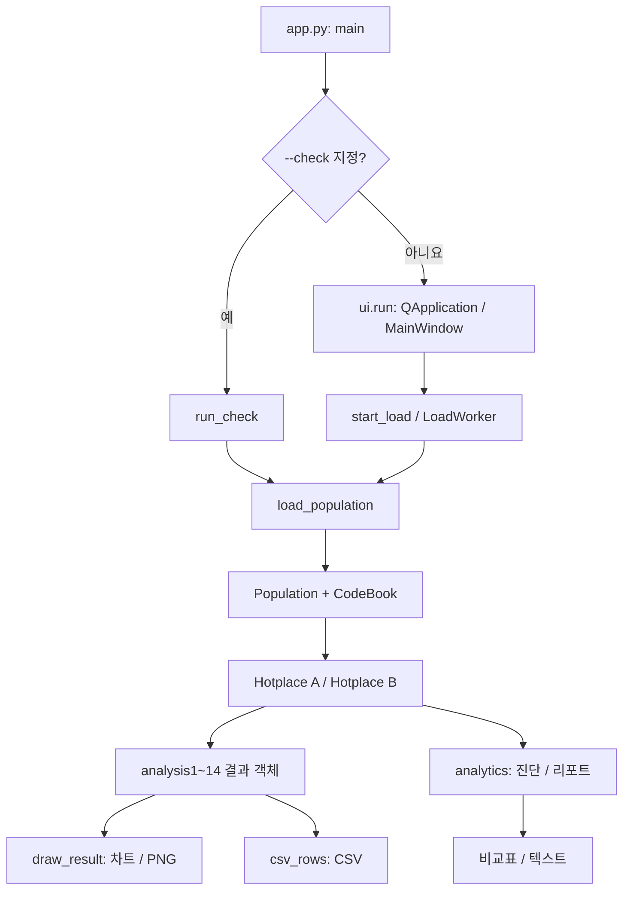

# Original ver — 코드 레벨 해설

대상: [seoul-population](seoul-population/) · [문서 목록](README.md) · [Kitty ver](kitty-ver.md)

## 1. 프로젝트를 한 문장으로 설명하면

서울 생활인구 CSV를 행정동별로 집계하고, 선택한 두 행정동의 시간·요일·성별·연령 패턴을 같은 기준으로 비교하는 Python 데스크톱 앱이다.

핵심 설계는 **데이터 읽기 → 분석 결과 생성 → 화면에 그리기**를 나누는 것이다. `Hotplace.analysisN()`은 창을 띄우지 않고 결과 객체를 반환한다. GUI와 CSV 내보내기는 이 결과 객체를 사용한다.

### 주요 파일과 책임

| 파일 | 핵심 이름 | 책임 |
|---|---|---|
| [app.py](seoul-population/app.py) | `main`, `resolve_paths`, `run_check` | GUI/명령줄 실행 분기 |
| [dataset.py](seoul-population/hotplace/dataset.py) | `Dong`, `CodeBook`, `DongAggregate`, `Population`, `load_population` | CSV 검증, 행정동 조회, 집계, 품질, 디스크 캐시 |
| [hotplace.py](seoul-population/hotplace/hotplace.py) | `Hotplace`, 결과 데이터 클래스 | 평균·비율·14개 분석·요약 통계 |
| [analytics.py](seoul-population/hotplace/analytics.py) | `diagnostics`, `compare_places`, `insight_cards`, `report_text` | 진단 지표와 비교 리포트 |
| [ui.py](seoul-population/hotplace/ui.py) | `MainWindow`, `LoadWorker`, `RegionSelector` | 네 화면 구성, 사용자 이벤트, 로딩, 저장 |
| [widgets.py](seoul-population/hotplace/widgets.py) | `AnimatedStack`, `AnalysisTabs`, `ComparisonMetrics`, `ComparisonTable` | 재사용 화면 요소와 전환 |
| [plotting.py](seoul-population/hotplace/plotting.py) | `PlotCanvas`, `draw_result`, `HoverCallout` | matplotlib 렌더링, 값 판독, 확대·이동 |
| [theme.py](seoul-population/hotplace/theme.py) | `Theme`, `apply_theme`, `make_icon` | Qt·차트가 함께 쓰는 색, 글꼴, SVG 아이콘 |
| [Hotplace.spec](seoul-population/Hotplace.spec) | `Analysis`, `EXE`, `BUNDLE` 설정 | macOS 앱 패키징 |

`dataset.py`, `hotplace.py`, `analytics.py`에는 Qt 의존성이 없다. 화면 없이 계산을 검증할 수 있는 이유다. 다만 `app.py --check`는 렌더링 모듈도 가져오므로 앱의 설치 의존성 자체가 없어지는 것은 아니다.

## 2. 전체 실행 흐름



### 2.1 진입점: `app.py`

`main()`은 `argparse`로 인자를 읽고 다음 두 경로 중 하나를 실행한다.

```python
if args.check is not None:
    return run_check(args)

from hotplace.ui import run
return run(args.population, args.codes)
```

`--check`는 `nargs="?", const=""`로 정의한다. 옵션 자체가 없으면 `None`, 지역명 없이 옵션만 주면 빈 문자열이 된다. 그래서 `if args.check:`가 아닌 `is not None`으로 실행 모드를 판단한다.

| 인자 | 역할 |
|---|---|
| `--population` | 생활인구 CSV 경로 |
| `--codes` | 행정동 코드표 경로 |
| `--check [행정동명]` | GUI 창 없이 로딩, 14개 분석, 품질·리포트 출력 |
| `--out 폴더` | `--check` 실행 시 분석별 PNG 14개 저장 |

`run_check()`는 검색 결과 중 데이터에 있는 첫 지역을 A로 정한다. 지역명을 생략하면 일평균 순위의 첫 지역을 선택한다. B는 상위 5곳에서 A와 다른 첫 지역이며, 다른 지역이 없으면 A와 같게 둔다.

CLI에서 분석 1·2·3·5·6은 A만의 결과를 만든다. 분석 7·10·11·13은 A/B 결과를 `PairedAnalysis`로 묶으며, 분석 4·8·9·12·14는 메서드 자체가 두 지역을 받는다. GUI에서는 단일 지역용 분석을 모두 A/B로 묶으므로, CLI의 일부 PNG와 GUI 차트의 패널 수는 다르다.

### 2.2 GUI 진입: `ui.run()`

`QApplication` 생성 → 시스템 창 배경 밝기로 초기 테마 선택 → `MainWindow` 생성 → 명령줄 경로를 입력란에 반영 → `show()` → `app.exec()` 순서다.

`app.exec()`는 클릭·키 입력·스레드 신호를 처리하는 Qt 이벤트 루프다. 명령줄 경로를 지정해도 즉시 로딩하지는 않는다. 사용자가 데이터 불러오기를 실행하면 로딩이 시작된다.

## 3. CSV를 분석용 자료구조로 바꾸기

소스: [dataset.py](seoul-population/hotplace/dataset.py)

### 3.1 입력 열은 이름이 아닌 위치로 읽는다

생활인구 CSV는 한 줄 헤더를 건너뛰고 다음 인덱스를 사용한다.

| Python 인덱스 | 값 |
|---|---|
| `0` | 기준일 `YYYYMMDD` |
| `1` | 시간대 `0~23` |
| `2` | 행정동 코드 |
| `3` | 총생활인구 |
| `4:18` | 남자 14개 연령대 |
| `18:32` | 여자 14개 연령대 |

`AGE_BANDS`는 `0-9`, `10-14`, …, `65-69`, `70+`의 14구간이다. 파일은 `utf-8-sig`로 읽어 UTF-8 BOM을 처리한다. 최소 32열인지 검사하지만, 열 이름으로 순서를 재배치하지는 않는다.

`CodeBook.from_csv()`는 코드표의 한글·영문 헤더 두 줄을 건너뛴다. `row[1]`을 코드, `row[2:5]`를 시도·시군구·행정동명으로 사용한다. 두 파일은 정수 행정동 코드로 연결한다.

### 3.2 네 자료구조의 관계

| 구조 | 주요 필드 | 의미 |
|---|---|---|
| `Dong` | `code`, `sido`, `sigungu`, `name` | 불변 행정동 정보. `label`은 `강남구 역삼1동` 형식 |
| `CodeBook` | `_dongs`, `_by_code` | 전체 지역 목록과 코드 기반 조회 사전 |
| `DongAggregate` | `total`, `weekday`, `weekend`, `age`, `daily`, 관측 횟수 배열 | 한 행정동의 집계 |
| `Population` | `aggregates`, `dates`, `n_days`, `duplicate_rows` | 전체 행정동 집계와 기간·품질 정보 |

한 행정동의 내부 구조를 축약하면 다음과 같다.

```text
DongAggregate
  total[24]                 시간별 총생활인구 누적
  counts[24]                시간별 실제 관측 횟수
  weekday[24]               평일 누적
  weekday_counts[24]        평일 관측 횟수
  weekend[24]               주말 누적
  weekend_counts[24]        주말 관측 횟수
  age[24][28]               시간 × 성별·연령 누적
  daily["20260101"][9]      그 날짜 09시의 총생활인구
```

예를 들어 두 날짜의 09시 인구가 100명, 200명이면 `total[9] == 300`, `counts[9] == 2`다. `daily`에는 날짜별 원래 총생활인구를 따로 남겨 일별 추이와 중복 확인에 쓴다.

원본의 모든 열을 메모리에 보관하지는 않지만, `daily`에는 날짜·시간별 총인구가 남는다. 따라서 메모리 사용량이 행정동당 24개 값으로만 고정되는 구조는 아니다.

### 3.3 `load_population()`의 처리 순서

1. 두 파일 존재 여부를 확인하고 `CodeBook`을 만든다.
2. 사용 가능한 캐시가 있으면 `Population`을 복원한다.
3. 캐시가 없으면 CSV를 한 행씩 읽는다.
4. 날짜 형식과 유효 날짜, 시간 범위, 정수 코드, 인구 숫자를 검증한다.
5. 음수·NaN·무한대, 부족한 열을 거부한다. 빈 행은 건너뛴다.
6. `(행정동, 날짜, 시간)` 중복이면 첫 행을 유지하고 `duplicate_rows`만 증가시킨다.
7. 총인구·평일/주말·성별/연령의 누적과 관측 횟수를 갱신한다.
8. 인구 파일과 코드표에 매칭되는 지역이 하나도 없으면 `DataError`를 발생시킨다.
9. `Population`을 구성하고 캐시 저장 후 `(population, codebook)`을 반환한다.

반복문에서는 `cancelled()` 콜백을 확인한다. `progress(percent, message)`는 화면과 분리된 일반 함수 형태로 받으며, CSV 처리 중에는 20,000행마다 진행 상황을 보고한다. 예상 행 수는 파일 앞부분 최대 500행의 평균 길이로 추정한다.

인구 값의 범위는 검사하지만 `총생활인구 == 남녀 28개 값의 합`을 강제하지 않는다. 성별·연령 비율이 총생활인구 열 대신 성별·연령 집계를 분모로 사용하는 이유도 이 구분에 있다.

### 3.4 관측 일수와 달력 일수

`Population.n_days`는 파일에 등장한 서로 다른 날짜 수다. `calendar_dates`는 최초 날짜부터 최종 날짜까지 빠진 날도 포함한 연속 날짜 목록이다.

```text
quality().observed = 모든 행정동의 counts 합
quality().expected = 발견된 행정동 수 × calendar_dates 길이 × 24
quality().coverage = observed / expected
```

완전성은 누락 관측의 비율이다. 코드표에만 있고 인구 CSV에는 한 번도 등장하지 않은 행정동은 `expected`에 포함되지 않는다. `unmatched`는 인구 파일에서 발견했지만 코드표에 없는 코드 수다.

### 3.5 경로와 디스크 캐시

`default_data_dir()`는 유효한 `HOTPLACE_DATA_DIR`, 저장소 루트의 `data/`, 형제 저장소 `Univ_Programming1/Lectures/midterm/data/` 순서로 찾는다. 저장소 루트는 가장 가까운 상위 `pyproject.toml`을 기준으로 한다. `find_population_csv()`는 이름순 정렬의 마지막 `LOCAL_PEOPLE_DONG_*.csv`를 선택한다.

`_cache_path()`는 두 파일의 **절대 경로·크기·나노초 수정시각**을 합쳐 SHA-1 키를 만든다. 파일 내용 전체의 해시를 계산하는 방식은 아니다.

- 파일 이름: `agg-v4-<키>.pickle`
- 소스 실행 위치: 프로젝트의 `.cache/`
- macOS 번들 실행 위치: `~/Library/Caches/Hotplace/`
- 손상된 캐시: 삭제 후 CSV 다시 읽기
- 캐시 저장 실패: 분석은 계속 진행
- `use_cache=False`: 캐시 읽기·쓰기를 생략

## 4. `Hotplace`와 분석 결과 객체

소스: [hotplace.py](seoul-population/hotplace/hotplace.py)

### 4.1 `Hotplace`는 한 행정동에 대한 분석 창구다

```python
place = Hotplace(dong, population)
```

생성자는 `population.get(dong.code)`를 `_agg`로 참조한다. CSV를 다시 읽거나 집계를 복사하지 않는다. 분석 메서드는 이 집계에서 평균·비율을 계산한다.

`_mean()`의 핵심 분기는 다음과 같다.

```python
if self._agg.daily:
    return [v / n if n else float("nan")
            for v, n in zip(values, counts)]
return [v / fallback_days if fallback_days else float("nan")
        for v in values]
```

실제 CSV를 읽은 집계는 시간별 관측 횟수로 나눈다. `daily` 없이 누적값만 직접 만든 강의 예제·테스트용 집계는 전체 일수로 나누는 호환 경로를 사용한다.

예를 들어 기간이 3일인데 특정 시간 관측이 100명, 200명 두 번만 있으면 평균은 `300 / 2 = 150`명이다. 관측이 없으면 0이 아니라 `NaN`을 반환한다. `finite_mean()`은 계산 가능한 값만 평균한다.

### 4.2 결과 데이터 클래스가 계산과 화면을 연결한다

| 결과 타입 | 담는 정보 | 사용 예 |
|---|---|---|
| `LineSeries` | 제목, 계열명, 계열별 값, 날짜/요일 눈금, 단위, 기준선 | 시간대·일별·여성 비율 |
| `AgePyramid` | 연령 구간, 남자·여자 평균 배열 | 연령 피라미드 |
| `Heatmap` | 2차원 값, 행 이름, 단위·비율 여부 | 요일×시간, 연령×시간 |
| `HourlyGap` | A/B 시간대 평균, `gap = A - B` 속성 | 시간대별 차이 |
| `AgeShares` | A/B 연령 비중 배열 | 연령별 두 점 비교 |
| `CityScatter` | 행정동명, 두 배율, A/B 표시 | 서울 속 위치 |
| `PairedAnalysis` | 지역명 두 개와 같은 종류의 결과 두 개 | 동일 분석의 A/B 패널 |

각 결과는 `csv_rows()`를 제공한다. 화면 모양을 몰라도 분석 결과를 CSV 행으로 바꿀 수 있다. `LineSeries`는 이름과 달리 시간대뿐 아니라 날짜·요일 축도 처리한다.

### 4.3 14개 분석의 코드와 계산 기준

아래 반환 타입은 `Hotplace` 메서드 자체의 타입이다. GUI에서 A/B로 묶는 처리는 이후에 수행한다.

| 메서드 | 반환 타입 | 계산·구현 |
|---|---|---|
| `analysis1()` | `LineSeries` | `mean_hourly()` → 시간별 `total / counts` |
| `analysis2()` | `LineSeries` | `mean_weekday()`, `mean_weekend()` → 그룹별 시간 관측 평균 |
| `analysis3()` | `LineSeries` | `age[h][:14]`, `age[h][14:]`를 각각 합한 뒤 시간별 관측 횟수로 나눔 |
| `analysis4(other)` | `LineSeries` | 두 지역의 `mean_hourly()`를 한 결과의 두 계열로 결합 |
| `analysis5()` | `AgePyramid` | 성별·연령 누적을 전체 실제 관측 수로 나눔 |
| `analysis6()` | `LineSeries` | 24시간이 모두 있는 날짜만 일평균 계산, 완전한 연속 7일의 이동평균 |
| `analysis7()` | `Heatmap` | `daily`를 요일·시간별로 모아 각 칸의 평균, 크기 `7 × 24` |
| `analysis8(other)` | `LineSeries` | 각 지역 시간별 평균 ÷ 그 지역 시간대 평균의 평균 × 100 |
| `analysis9(other)` | `HourlyGap` | A/B 시간대 평균 저장, `gap` 속성으로 시간별 차이 계산 |
| `analysis10()` | `LineSeries` | `analysis7().values`의 각 요일 행을 `finite_mean()`으로 평균 |
| `analysis11()` | `LineSeries` | 시간별 여자 평균 ÷ 남녀 평균 합 × 100, 기준선 50% |
| `analysis12(other)` | `AgeShares` | 남녀 합산 연령별 평균 ÷ 전체 연령 평균 합 × 100 |
| `analysis13()` | `Heatmap` | 시간별 남녀 합산 연령 누적 ÷ 그 시간의 전체 연령 누적 × 100, 크기 `14 × 24` |
| `analysis14(other, codebook)` | `CityScatter` | 매칭된 행정동 중 두 배율이 유한한 지역을 `character_points()`로 수집 |

`analysis13()`은 `values[::-1]`, `AGE_BANDS[::-1]`로 나이 많은 구간을 먼저 반환한다. `analysis14()`는 선택 지역을 `A`, `B`, 같은 지역이면 `A·B`로 표시한다.

평일/주말은 날짜의 `weekday() >= 5`로 구분한다. 평일에 있는 공휴일을 주말로 재분류하지 않는다.

### 4.4 서로 다른 평균을 구분해야 한다

- `summary()["daily_avg"]`: 관측 가능한 **시간대별 평균의 평균**이다. 시간대별 관측 횟수가 달라도 각 시간대에 같은 비중을 준다.
- `analysis6()`의 일평균: **특정 날짜의 24시간 값의 평균**이다. 한 시간이라도 빠지면 그 날짜는 `NaN`이다.
- `mean_by_age()`: 성별·연령 누적을 **전체 실제 관측 수**로 나눈다.
- `analysis10()`: 요일별 원본 행 전체를 한꺼번에 평균하지 않고, 요일×시간 평균을 다시 시간 방향으로 평균한다.

모두 특정 시점의 생활인구를 평균한 값이다. 하루 동안 방문한 서로 다른 사람 수를 계산하는 코드는 없다.

### 4.5 요약 지표와 상권 유형

`summary()`는 `daily_avg`, `peak_hour`, `low_hour`, `swing`, `day_night_ratio`, `weekend_ratio`, 성비, `character`를 반환한다.

```text
낮 평균 = 09~18시 시간대 평균들의 평균
밤 평균 = 00~06시 시간대 평균들의 평균
낮/밤 배율 = 낮 평균 / 밤 평균
주말/평일 배율 = 주말 시간대 평균들의 평균 / 평일 시간대 평균들의 평균
```

`_character()`는 아래 조건을 **위에서부터 순서대로** 검사한다.

| 결과 | 조건 |
|---|---|
| 판단 보류 | 필요한 평균이 유한하지 않거나 평일·밤 기준 인구가 0 |
| 주말 상권형 | 주말/평일 ≥ `1.03`, 정점 `11~21시` |
| 업무지구형 | 주말/평일 ≤ `0.93`, 정점 `09~18시`, 낮/밤 ≥ `1.3` |
| 주거지형 | 정점 `20~23시` 또는 `00~06시`, 또는 낮/밤 ≤ `1.05` |
| 혼합형 | 위 조건에 해당하지 않음 |

이는 규칙 기반 참고 분류다. 학습된 예측 모델은 없다. 서울 속 위치 차트는 같은 배율 상수를 기준선에 쓰지만, 정점 시간 조건까지 시각화하지는 않는다.

## 5. 진단과 리포트 계산

소스: [analytics.py](seoul-population/hotplace/analytics.py)

### 5.1 `diagnostics(place)`

| 항목 | 구현 |
|---|---|
| 붐비는/한산한 3시간 | 시작 시각 24개를 순회하고 `(h + step) % 24`로 자정 연결 구간까지 계산 |
| 변동성 | 유효 시간대 값의 모집단 표준편차 `pstdev` ÷ 평균 × 100 |
| 청년·고령 비중 | 연령 배열 `3:7`은 20~39세, `12:`는 65세 이상 |
| 평소와 다른 날 | 완전한 일자를 평일·주말로 나누고 중앙값·MAD 사용 |
| 관측 완전성 | 해당 지역 관측 수 ÷ 기간의 달력 일수 ÷ 24 × 100 |
| 서울 내 순위 | `rank_by_daily_average()` 결과에서 행정동 코드로 순위 조회 |

이상 일자 계산은 각 그룹에 완전한 날짜가 7개 이상이고 `MAD > 0`일 때만 진행한다.

```text
MAD = median(abs(일평균 - 그룹 중앙값))
수정 z = 0.67448975 × (일평균 - 그룹 중앙값) / MAD
abs(수정 z) > 3.5 이면 표시
```

### 5.2 `compare_places(left, right)`

두 지역 모두 값이 있는 시간만 `common`에 모은다. 여기서 Pearson 상관계수, 평균 차이, 상대 차이, 절대 차이가 가장 큰 시간을 계산한다. 공통 시간이 3개 미만이거나 분산이 0이면 상관계수는 `NaN`이다.

`similarity_label()`은 상관계수가 0.9 이상이면 ‘매우 비슷함’, 0.7 이상이면 ‘비슷함’, 0.4 이상이면 ‘조금 비슷함’, 나머지는 ‘다름’으로 표현한다.

### 5.3 계산값을 UI와 텍스트로 전달하기

`ROWS`는 여섯 항목의 키·제목·계산 기준을 정의한다. `insight_cards()`가 이를 `Insight(category, title, detail)` 목록으로 만들고, UI의 `ComparisonTable`과 `report_text()`가 사용한다.

현재 **리포트 화면의 일평균 차이 카드와 텍스트 리포트의 평균 차이는 기준이 다를 수 있다.** `ui._update_intelligence()`는 지역별 `summary()["daily_avg"]`를 비교하고, `report_text()`는 `compare_places()["difference"]`, 즉 공통 관측 시간의 평균 차이를 출력한다. 두 지역의 누락 시간대가 다르면 숫자가 달라질 수 있다. 문서에서는 이를 같은 계산으로 간주하지 않는다.

## 6. GUI 상태와 이벤트 흐름

소스: [ui.py](seoul-population/hotplace/ui.py), [widgets.py](seoul-population/hotplace/widgets.py)

### 6.1 `MainWindow`가 보유하는 상태

| 필드 | 의미 |
|---|---|
| `population`, `codebook` | 로딩에 성공한 현재 데이터 |
| `_thread`, `_worker` | 진행 중인 CSV 로딩 작업 |
| `_results[index]` | 현재 A/B 선택에서 계산한 차트 결과 객체 |
| `_closing` | 로딩 중 종료 요청을 받았는지 |
| `region_a`, `region_b` | 선택된 행정동을 가진 `RegionSelector` |
| `tabs` | 선택한 차트와 그룹별 마지막 차트 상태 |

화면 스택의 인덱스는 `0 지역 비교`, `1 지역 찾기`, `2 데이터`, `3 비교 리포트`다. 메뉴에 보이는 순서와 내부 인덱스는 별개다.

### 6.2 백그라운드 로딩

```text
불러오기 클릭
  → MainWindow.start_load()
  → LoadWorker를 QThread로 이동
  → thread.started → worker.run()
  → load_population(progress=신호 전달, cancelled=중단 여부)
      ├─ progress → _on_progress()
      ├─ loaded → _on_loaded()
      └─ failed → _on_failed()
```

`LoadWorker`는 `progress = Signal(int, str)`, `loaded = Signal(object, object)`, `failed = Signal(str)`를 사용한다. 워커가 위젯을 직접 수정하지 않고 신호로 메인 화면에 결과를 전달한다.

`start_load()`는 중복 로딩을 막고 경로 입력과 로딩 버튼을 비활성화한다. `_on_loaded()`에서만 현재 데이터를 교체하고, 순위 상위 두 지역을 A/B 초기값으로 설정한다. 지역이 하나면 같은 지역을 양쪽에 선택한다.

실패 시 `_on_failed()`는 오류를 표시하지만 이전 `population`을 덮어쓰지 않는다. `_finish_thread()`는 `quit()`·`wait()`·`deleteLater()`로 작업을 정리하고 입력을 다시 활성화한다.

로딩 중 창을 닫으면 `closeEvent()`가 `requestInterruption()`을 요청하고 최초 종료 이벤트를 보류한다. 워커 처리가 끝나면 스레드를 정리하고 다시 창을 닫는다. 중단 요청은 CSV 반복문에서 확인하므로 캐시 복원 같은 단계가 즉시 중단되는 구조는 아니다.

### 6.3 지역 변경에서 차트 갱신까지

```text
자치구/행정동 선택
  → RegionSelector.changed
  → _on_region_changed()
      ├─ _results.clear()
      ├─ _update_summary()
      ├─ _render_current()
      └─ _update_intelligence()
```

`RegionSelector`는 행정동 객체를 `ComboBox`의 `userData`에 넣는다. 화면에 표시된 이름을 다시 파싱하지 않고 `currentData()`로 `Dong`을 가져온다. 자치구 변경 시 인구 데이터에 실제로 있는 행정동만 목록에 넣는다.

`_swap_regions()`는 A/B 신호를 잠시 차단하고 두 선택을 교환한 뒤 한 번 갱신한다. 차트 선택은 그대로 유지한다. 같은 지역 선택도 허용하며 안내 문구를 표시한다.

### 6.4 차트 번호로 분석 메서드 선택하기

차트 인덱스는 0부터 시작하고 분석 번호는 1부터 시작한다.

```python
method = f"analysis{index + 1}"
if index in PAIR_TABS:             # {3, 7, 8, 11}
    result = getattr(place_a, method)(place_b)
elif index == CITY_TAB:            # 13
    result = place_a.analysis14(place_b, self.codebook)
else:
    result = PairedAnalysis(
        title=...,
        regions=(place_a.label, place_b.label),
        analyses=(getattr(place_a, method)(),
                  getattr(place_b, method)()),
    )
```

위 코드는 제목 등 표시용 인자를 줄인 발췌다. `getattr()`로 선택한 이름의 메서드를 호출한다. `PAIR_TABS`는 이미 메서드가 두 지역을 받는 분석이므로 이중으로 묶지 않는다.

`_results`는 **계산 결과**의 메모리 캐시다. `dataset.py`의 디스크 캐시와 별개다. 아직 보지 않은 분석은 선택 시 계산하고, 지역을 바꾸면 캐시를 비운다. 같은 탭을 다시 표시할 때 결과 객체는 재사용하되 `draw_result()`로 그림은 다시 그린다.

### 6.5 탭·검색·리포트 위젯

- `AnalysisTabs`: 위쪽 `SegmentedWidget`으로 분류, 아래쪽 `Pivot`으로 차트를 고른다. `_group_of`는 차트→그룹 매핑, `_last`는 그룹별 마지막 차트다.
- `ComparisonMetrics`: 네 지표를 가로로 배치한다. `MetricLabels.update_place()`가 각 지표의 A/B 값을 갱신한다.
- `CodeBook.search()`: 동명·코드의 정확한 일치를 우선하고, 없으면 `구 + 동명` 문자열의 부분 일치를 사용한다. 여러 결과는 `DongPickDialog`로 고른다.
- `_refresh_ranking()`: 일평균·최대 시간대 인구·주말/평일·낮/밤의 네 기준으로 상위 20곳을 만든다. 선택 행의 `Qt.UserRole`에 저장된 `Dong`을 A/B에 넣는다.
- `ComparisonTable`: 항목·A·B의 3열 그리드다. `chartRequested` 신호로 해당 항목의 분석 탭을 연다.

### 6.6 전환 애니메이션

`AnimatedStack.setCurrentIndex()`는 목적 페이지를 즉시 선택하고, 이전 화면을 캡처한 `TransitionOverlay`를 위에 겹쳐 페이드·슬라이드한다. 오버레이는 마우스 이벤트를 통과시키므로 목적 화면은 전환 중에도 조작할 수 있다.

페이지 전환은 240ms, 차트 전환은 220ms이며 `QEasingCurve.OutCubic`을 쓴다. 크기 변경과 빠른 연속 선택은 기존 전환을 중단한다. `HOTPLACE_REDUCED_MOTION=1` 또는 앱의 `reducedMotion` 속성으로 효과를 끈다.

## 7. 분석 결과를 차트로 그리기

소스: [plotting.py](seoul-population/hotplace/plotting.py)

`PlotCanvas`는 `FigureCanvasQTAgg`를 상속하므로 matplotlib 그림을 Qt 위젯으로 배치할 수 있다. `draw_result()`는 결과 타입으로 렌더러를 선택한다.

| 결과 | 렌더러 | 주요 표현 |
|---|---|---|
| `PairedAnalysis` | `draw_paired_analysis()` | 일반 차트·피라미드는 좌우, 축 공유 |
| 내부 결과가 `Heatmap` | `draw_heatmaps()` | 위아래, A/B 전체에서 구한 공통 색 최댓값 |
| `HourlyGap` | `draw_gap()` | 0 위/아래를 A/B 색으로 구분한 막대 |
| `AgeShares` | `draw_age_shares()` | 연령별 두 점과 연결선 |
| `CityScatter` | `draw_city_scatter()` | 전체 행정동 산점도, 낮/밤 축은 로그 |
| `AgePyramid` | `draw_age_pyramid()` | 남자를 음수 좌표로 그려 좌우 대칭 막대 구성 |
| `LineSeries` | `draw_line_series()` | 선·정점 라벨·조건부 영역 채우기 |

`sharex=True, sharey=True`와 두 지역 전체 값으로 정한 범위를 사용해 A/B를 비교한다. 피라미드의 남자 값은 그림에서만 음수 방향으로 바꾸며 원래 분석값과 CSV는 양수다. 히트맵은 원본도 위아래 배치다.

### 7.1 원본 렌더러의 구현 특징

- `DPI = 72`, `EXPORT_DPI = 144`, `FIGSIZE = (820 / DPI, 500 / DPI)`를 공통 상수로 사용한다.
- `RoundedBar`는 `Rectangle`을 상속하고 경로를 바꿔 막대 값 쪽 끝을 둥글게 그린다.
- `_area()`는 단일 계열의 아래 영역을 그라데이션으로 채운다.
- `_trailing_values()`는 값 축을 오른쪽에 둔다. `_short()`는 큰 수를 ‘만’ 단위로 줄여 표시한다.
- `_region_title()`은 A/B 배지 형태 제목을, `_legend()`는 차트 아래 범례를 구성한다.

### 7.2 값 판독과 확대·이동

`set_hover_series()`는 같은 시간의 A/B 값을 함께 읽도록 등록한다. `_on_motion()`이 선택된 위치를 계산하면 `HoverCallout`에 값과 계열색을 표시한다. 히트맵·연령 비중·산점도는 `set_hover_lookup()`에 전용 조회 함수를 등록한다.

확대·이동은 matplotlib 도구 모음 대신 `PlotCanvas`에서 직접 처리한다.

- `set_navigation()`: 처음 축 범위를 `_home`에 저장한다.
- `wheelEvent()`: Control 수정키가 있는 스크롤만 확대에 사용하고 일반 스크롤은 페이지로 넘긴다.
- `event()`: 네이티브 핀치·스마트 확대 제스처를 처리한다.
- `_on_press()`·`_pan()`: 드래그 이동, 두 번 클릭 시 `reset_view()`를 처리한다.
- `_limit()`: 처음 범위를 벗어나지 않고 `MAX_ZOOM = 12`보다 깊게 확대하지 않도록 제한한다.
- `zoomChanged`: ‘원래 크기’ 버튼 표시 상태를 갱신한다.

선·차이 막대·히트맵은 가로축 탐색을 등록하고, 서울 속 위치는 두 축을 등록한다. 피라미드와 연령 비중은 탐색을 등록하지 않는다.

## 8. 테마와 파일 저장

### 테마

[theme.py](seoul-population/hotplace/theme.py)의 `Theme`는 불변 데이터 클래스다. `LIGHT`와 `DARK`에 화면 배경·텍스트·A/B 계열·히트맵 색을 모은다.

`apply_theme()`는 Fluent 테마, `QPalette`, 글꼴, Qt 스타일시트를 함께 적용한다. 위젯의 `role` 속성과 `objectName`으로 스타일을 지정하며, 차트도 `theme()`에서 같은 팔레트를 읽는다. 밝은 테마의 A는 `#6fb07d`, B는 `#ae96da`이고, 배지 글자는 별도 `series_ink`를 사용한다.

`make_icon()`은 코드 안의 SVG 경로를 `QSvgRenderer`로 그린다. `_toggle_theme()`는 전환을 정리하고 팔레트·아이콘·현재 차트·리포트를 갱신한다.

### 내보내기

- `_save_png()`: 현재 결과가 있는지 확인 → 저장 경로 선택 → `clear_hover()` → `figure.savefig(..., dpi=EXPORT_DPI)`.
- `_export_csv()`: 현재 결과의 `csv_rows()`를 `csv.writer`에 전달한다. 인코딩은 `utf-8-sig`다.
- `_export_report()`: `report_text()` 결과를 UTF-8 텍스트로 저장한다.

`PairedAnalysis.csv_rows()`는 공통 첫 열에 A/B 열을 이어 붙이고 지역명·계열명을 헤더에 넣는다. 일반 수치는 소수 첫째 자리, `CityScatter`의 배율은 소수 셋째 자리로 저장한다. `csv_number()`는 계산 불가능한 값을 빈 문자열로 바꾼다.

현재 PNG는 화면의 Figure를 저장하므로 확대된 축 범위가 반영된다. 마우스 판독용 가이드는 저장 전에 제거한다.

## 9. 실행과 검증

저장소 루트에서 실행한다.

```bash
uv sync
uv run studies/study1/seoul-population/app.py
uv run studies/study1/seoul-population/app.py --check 역삼1동
uv run studies/study1/seoul-population/app.py --check 역삼1동 --out /tmp/hotplace-original-charts
uv run python -m unittest discover -s studies/study1/seoul-population/tests -v
```

기본 CSV를 찾지 못하면 `--population /실제/인구.csv --codes /실제/코드.csv`를 함께 지정한다.

| 테스트 | 확인하는 계약 |
|---|---|
| [test_analytics.py](seoul-population/tests/test_analytics.py) | 완전 데이터 평균, 중복 제외, 누락 처리, 이동평균, 비율, A/B 대칭성, 이상 일자, 검증 오류·취소 |
| [test_comparison.py](seoul-population/tests/test_comparison.py) | A/B 내보내기, 공통 축, 선택 유지, 검색·순위, 값 판독, 확대 범위·초기화, 테마·모션, 재로딩 실패·종료 |

분석 테스트는 임시 CSV나 합성 집계를 만든다. 화면 테스트는 `QT_QPA_PLATFORM=offscreen`과 `QTest`·matplotlib 마우스 이벤트를 사용한다. 실제 서울 CSV 없이 동작을 확인할 수 있지만, 합성 테스트 통과가 실제 데이터 전체의 정확성을 검증했다는 뜻은 아니다.

`Hotplace.spec`는 `arm64` macOS 앱을 구성하고 Fluent 리소스와 QtAgg/Agg 백엔드를 포함한다. CSV는 번들에 넣지 않는다. 빌드 실행 방법은 프로젝트의 [기존 README](seoul-population/README.md)에 있다.

## 10. 코드 설명 발표 순서

1. `app.py`: GUI와 `--check`가 같은 로더·분석 모델을 사용한다.
2. `DongAggregate`: 누적값과 관측 횟수를 함께 저장해야 누락을 0으로 오해하지 않는다.
3. `Hotplace.analysis1()`과 `analysis9()`: 단일 지역 결과와 두 지역 비교 결과의 차이를 보여준다.
4. `PairedAnalysis`: 단일 지역 분석을 A/B 공통 축 비교로 확장하는 연결부다.
5. `MainWindow._on_region_changed()`·`_render_current()`: 사용자 입력이 결과 계산과 렌더링으로 이어진다.
6. `draw_result()`: 결과의 타입에 따라 그리는 함수를 선택한다.
7. `csv_rows()`와 테스트: 화면과 분리된 결과 객체가 내보내기와 자동 검증을 가능하게 한다.

분석을 추가할 때는 `Hotplace` 메서드뿐 아니라 `TAB_TITLES`·`CHART_TITLES`·`TAB_GROUPS`, A/B 인자 분기, `run_check()`의 결과 목록도 함께 살펴야 한다. 새 결과 타입을 만들면 `csv_rows()`와 `draw_result()` 분기도 필요하다.
